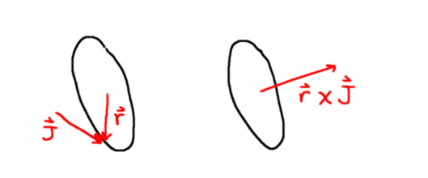
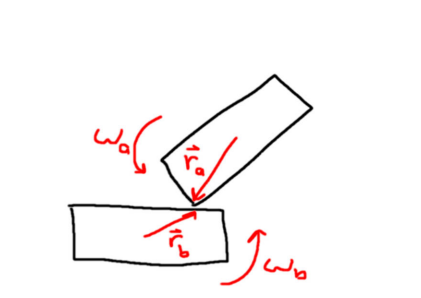

# Physics Programming - Basics

## Bodies

### Hello physics world

A typical physics simulation is just a collection of bodies that collide. And before we can simulate collisions, we need to discuss how to represent the bodies. Every body has a position in space. This can be represented with a vector in cartesian coordinates. We will use the Vec3 already present in the code. Also, bodies have orientations. We’re going to use quaternions to represent the orientation of our bodies. The final property that a body must have to be represented in our simulation is a shape. The shape defines the actual geometry of the body. There’s all kinds of shapes that we may want to use to represent a body, but in this course, we’re only going to bother with spheres. However, since we will simulate more general shapes later, we’re going to create a base shape class as well as a sphere shape class that inherits from it.

Let's implement the Body ans the Sphere shape.
```
#pragma once
#include "code/Math/Vector.h"
#include "code/Renderer/model.h"
#include "code/Math/Quat.h"

class Body
{
public:
	Vec3 position;
	Quat orientation;
	Shape* shape;
};
```

```
#pragma once
class Shape {
public:
	enum class ShapeType
	{
		SHAPE_SPHERE,
	};
	virtual ShapeType GetType() const = 0;

};

class ShapeSphere: public Shape {
public:
	ShapeSphere(float radiusP) : radius(radiusP) {}
	ShapeType GetType() const override { return ShapeType::SHAPE_SPHERE; }
	float radius;
};
```

We will create our first render with:
```
void Scene::Initialize() {
	Body body;
	body.position = Vec3( 0, 0, 0 );
	body.orientation = Quat( 0, 0, 0, 1 );
	body.shape = new ShapeSphere( 1.0f );
	bodies.push_back( body );
}
```

This will display a small sphere. The simulation runs at 60 FPS.

### Body space and world space.

We should probably quickly cover the difference between world space and body space. When things collide, we’re going to have information about where in world space that collision occured. And sometimes, we’re going to want to know where specifically on the body that hit is located. In order to do this, we’ll need a function that can transform a world space point to local space. And we’ll also want a function that can take us from local space to world space.

We also need to consider center of mass. We’ll get deeper into this concept later in this course. This is important to note because while body space is similar to model space, they are different. Model space is the space centered about the shape geometry’s origin. However, body space is centered about the center of mass. Fortunately for our sphere shapes, their center of mass coincides with their geometric center; which makes things easier for this course.

So, let’s go ahead and add the center of mass to the shape class.

```
class Shape {
public:
	enum class ShapeType
	{
		SHAPE_SPHERE,
	};

	virtual ShapeType GetType() const = 0;
	virtual Vec3 GetCenterOfMass() const { return centerOfMass; }

protected:
	Vec3 centerOfMass;
};

class ShapeSphere : public Shape {
public:
	ShapeSphere(float radiusP) : radius(radiusP)
	{
		centerOfMass.Zero();
	}

	ShapeType GetType() const override { return ShapeType::SHAPE_SPHERE; }
	float radius;
};
```

And now the world space and body space functions to our body class.
```
class Body
{
public:
	Vec3 position;
	Quat orientation;
	Shape* shape;

	Vec3 GetCenterOfMassWorldSpace() const;
	Vec3 GetCenterOfMassBodySpace() const;

	Vec3 WorldSpaceToBodySpace(const Vec3& worldPoint);
	Vec3 BodySpaceToWorldSpace(const Vec3& bodyPoint);
};
```

```
#include "Body.h"
#include "Shape.h"

Vec3 Body::GetCenterOfMassWorldSpace() const
{
 const Vec3 centerOfMass = shape->GetCenterOfMass();
 const Vec3 pos = position + orientation.RotatePoint(centerOfMass);
 return pos;
}

Vec3 Body::GetCenterOfMassBodySpace() const
{
 return shape->GetCenterOfMass();
}

Vec3 Body::WorldSpaceToBodySpace(const Vec3& worldPoint)
{
 const Vec3 tmp = worldPoint - GetCenterOfMassWorldSpace();
 const Quat invertOrient = orientation.Inverse();
 Vec3 bodySpace = invertOrient.RotatePoint(tmp);
 return bodySpace;
}

Vec3 Body::BodySpaceToWorldSpace(const Vec3& bodyPoint)
{
 Vec3 worldSpace = GetCenterOfMassWorldSpace() + orientation.RotatePoint(bodyPoint);
 return worldSpace;
}
```

### Gravity

Now that we have a body added to the scene and drawn to screen, it would be nice if it also moved. You may have noticed that objects move when an external force is applied to them. And you may have also noticed that all objects are affected by gravity. Therefore, a simple way to get objects moving in our little physics experiment is to apply gravity.

Positions change when they have velocity and the equation relating the change of position with the velocity is: dx = v ∗ dt

Velocities change when there is an acceleration. The equation relating the change of velocity with the acceleration is: dv = a ∗ dt

The acceleration due to the gravity applies to all objects equally, and near the surface of the Earth is approximately 9.8m/s 2. We, however are going to approximate this further to a nice round 10m/s 2 .

Since an object’s velocity is typically unique to itself, this is a new property that we should add to the body class:

```
class Body
{
public:
	Vec3 position;
	Quat orientation;
	Vec3 linearVelocity;
	...
```

We call this linear velocity because we are currently only concerned with translational velocity. We will get to rotational velocity later. Now, we can add gravity to the velocity of each body and then update the positions of the bodies by modifying the update function of the scene class like so:

```
void Scene::Update( const float dt_sec ) {
	for (int i = 0; i < bodies.size(); ++i) {
		bodies[i].linearVelocity += Vec3(0, 0, -10) * dt_sec;
	}
	for (int i = 0; i < bodies.size(); ++i) {
		bodies[i].position += bodies[i].linearVelocity * dt_sec;
	}
}
```

To test, do not forget to unpause the simulation by hitting T.

### Gravity as impulse

While directly adding the acceleration, due to gravity, to the velocity of a body works, it’s not exactly best for us in the long run. Gravity, is a force, and forces act on bodies that have mass. Force is defined as:

`F = m ∗ a`

And the force of gravity (near the surface of the earth) is defined as:

`F = m ∗ g`

where g is 9.8m/s 2 (or for us 10m/s 2). By setting these two equations equal to each other and solving for acceleration, we quickly find that the acceleration due to gravity is g.

Now, it’s perfectly valid to deal with gravity this way on paper, but we are going to try and make a robust physics simulation. And for the sake of the simulation it would be better if we applied all forces in a uniform way. In this sense, we would like to be agnostic about gravity and just treat it as we would any other force. The physics “engine” that we’re going to build will handle forces indirectly by applying impulses. This means we need to know what impulses are and how they affect momentum. Momentum is defined as:

`p = m ∗ v` (1)

You can think of momentum as the amount a moving object would like to keep moving in a particular direction. So, the more momentum an object has, the more force is required to change its momentum. The change in the momentum is related to the applied force by:

`dp = F ∗ dt`

Now the definition of impulse, J, is the change of momentum, so this means:

`J ≡ dp = F ∗ dt`		(triple equal is "equal by definition")

And from the relation (1), then:

`J = m ∗ dv`			(because `dp = m * dv`)

Which, solving for `dv` yields:

`dv = J/m`

This means that we can easily calculate the impulse due to gravity by multiplying the force of gravity by the time delta between frames, `dt`. And from that we can find the change in velocity by simply dividing by the mass of the body. Now we can go ahead and modify the body class to apply impulses.

```
class Body
{
public:
	...
	Vec3 linearVelocity;
	float inverseMass;
	...
	void ApplyImpulseLinear(const Vec3& impulse);
};
```

```
void Body::ApplyImpulseLinear(const Vec3& impulse)
{
 if (inverseMass == 0.0f) return;
 // dv = J / m
 linearVelocity += impulse * inverseMass;
}
```

It’s important to note that we’re actually storing the inverse mass, not the mass itself. There’s a couple of reasons for this. The first is that we need a way to describe objects with infinite mass. Nothing in the real world actually has infinite mass, but for the kinds of forces that we’re going to simulate, we can approximate certain objects as having infinite mass. For instance, a tennis ball thrown against the sidewalk. The tennis ball imparts a force upon the ground and the ground in turn imparts a force upon the ball, and the Earth itself will move a little. But the amount the Earth moves is so small that we can easily approximate this collision as the Earth having an infinite mass.

And now we can adjust our update loop to apply gravity as an impulse, instead of directly using it as an acceleration.

```
void Scene::Update( const float dt_sec ) {
	for (int i = 0; i < bodies.size(); ++i) {
		Body& body = bodies[i];
		float mass = 1.0f / body.inverseMass;
		// Gravity needs to be an impulse I
		// I == dp, so F == dp/dt <=> dp = F * dt <=> I = F * dt <=> I = m * g * dt
		Vec3 impulseGravity = Vec3(0, 0, -10) * mass * dt_sec;
		body.ApplyImpulseLinear(impulseGravity);
	}

	// Position update
	for (int i = 0; i < bodies.size(); ++i) {
		bodies[i].position += bodies[i].linearVelocity * dt_sec;
	}
}
```

Finally, we can also add a ground body, that won’t fall under the influence of gravity either:
```
void Scene::Initialize() {
	Body body;
	body.position = Vec3(0, 0, 10);
	body.orientation = Quat(0, 0, 0, 1);
	body.shape = new ShapeSphere(1.0f);
	body.inverseMass = 1.0f;
	bodies.push_back(body);

	Body earth;
	earth.position = Vec3(0, 0, -1000);
	earth.orientation = Quat(0, 0, 0, 1);
	earth.shape = new ShapeSphere(1000.0f);
	earth.inverseMass = 0.0f;
	bodies.push_back(earth);
}
```


## Collisions

### Sphere collisions

Sadly, we still don’t have any means of colliding two bodies. Which means running our code so far, will cause the small sphere to pass through the large sphere. This clearly won’t work for us. Fortunately, sphere sphere collisions are the simplest to test. And we can easily add this to our code.

Each sphere has a position, and this position is the center of the sphere in world space. A simple way to check for overlap is to compute the distance between these two points and then compare them with the sum of the two radii. If the distance is less than the two radii, then there’s an intersection.

Create a new Intersections class.

```
#pragma once
#include "Body.h"
#include "Shape.h"

class Intersections
{
public:
	bool Intersect(Body& a, Body& b);
};
```

```
#include "Intersections.h"

bool Intersections::Intersect(Body& a, Body& b)
{
	const Vec3 ab = b.position - a.position;
	if (a.shape->GetType() == Shape::ShapeType::SHAPE_SPHERE && b.shape->GetType() == Shape::ShapeType::SHAPE_SPHERE) {
		ShapeSphere* sphereA = reinterpret_cast<ShapeSphere*>(a.shape);
		ShapeSphere* sphereB = reinterpret_cast<ShapeSphere*>(b.shape);
		const float radiusAB = sphereA->radius + sphereB->radius;
		// We compare squares
		if (ab.GetLengthSqr() < radiusAB * radiusAB) {
			return true;
		}
	}

	return false;
}
```

We’re going to compare every body against every other body for an intersection. And since we need to do something when things intersect, we’re going to just set their velocity to zero for now.

```
void Scene::Update(const float dt_sec)
{
	...
	// Collision checks
	for (int i = 0; i < bodies.size(); ++i)
	{
		for (int j = i+1; j < bodies.size(); ++j)
		{
			Body& bodyA = bodies[i];
			Body& bodyB = bodies[j];
			if (bodyA.inverseMass == 0.0f && bodyB.inverseMass == 0.0f) continue;
			if (Intersections::Intersect(bodyA, bodyB))
			{
				bodyA.linearVelocity.Zero();
				bodyB.linearVelocity.Zero();
			}
		}
	}

	// Position update
	...
}
```

A couple of notes here. There’s no need to bother testing for intersections among pairs of bodies that both have infinite mass, since those bodies are never going to move anyway. So, we just skip those.

Running this new code, the body in the air falls until it hits the ground, then it stops. We now have our first glimpse into collision detection and we’re headed in the right direction. Now, it’s great that it stops. But if you look at it closely, you’ll notice that the two spheres are actually interpenetrating. What can we do about that?

### Contact and projection methods

We would like to work towards a physically based collision response for pairs of bodies, but first we need to solve this interpenetration. One way of solving it, is to use what’s known as the projection method. This uses the contacts points on the surface of each body and their masses to separate them appropriately.

Let’s start by defining a data structure for the contacts in a new Contact class:

```
#pragma once
#include "code/Math/Vector.h"
#include "Body.h"
class Contact
{
public:
	Vec3 ptOnAWorldSpace;
	Vec3 ptOnALocalSpace;
	Vec3 ptOnBWorldSpace;
	Vec3 ptOnBLocalSpace;

	Vec3 normal;
	float separationDistance;
	float timeOnImpact;

	Body* a{ nullptr };
	Body* b{ nullptr };

	static void ResolveContact(Contact& contact);
};

```

```
#include "Contact.h"

void Contact::ResolveContact(Contact& contact)
{
	Body* a = contact.a;
	Body* b = contact.b;

	a->linearVelocity.Zero();
	b->linearVelocity.Zero();
}
```

We update Intersection to take a contact parameter and use the Contact class in the Scene:
```
bool Intersections::Intersect(Body& a, Body& b, Contact& contact)
{
	contact.a = &a;
	contact.b = &b;
	const Vec3 ab = b.position - a.position;
	contact.normal = ab;
	contact.normal.Normalize();

	if (a.shape->GetType() == Shape::ShapeType::SHAPE_SPHERE && b.shape->GetType() == Shape::ShapeType::SHAPE_SPHERE) {
		ShapeSphere* sphereA = static_cast<ShapeSphere*>(a.shape);
		ShapeSphere* sphereB = static_cast<ShapeSphere*>(b.shape);

		contact.ptOnAWorldSpace = a.position + contact.normal * sphereA->radius;
		contact.ptOnBWorldSpace = b.position - contact.normal * sphereB->radius;

		const float radiusAB = sphereA->radius + sphereB->radius;
		// We compare squares
		if (ab.GetLengthSqr() < radiusAB * radiusAB) {
			return true;
		}
	}

	return false;
}
```

(Be careful: the contact point on b is position MINUS normal * radius.)

```
void Scene::Update(const float dt_sec)
{
	...
	// Collision checks
	for (int i = 0; i < bodies.size(); ++i)
	{
		for (int j = i+1; j < bodies.size(); ++j)
		{
			Body& bodyA = bodies[i];
			Body& bodyB = bodies[j];
			if (bodyA.inverseMass == 0.0f && bodyB.inverseMass == 0.0f) continue;

			Contact contact;
			if (Intersections::Intersect(bodyA, bodyB, contact))
			{
				Contact::ResolveContact(contact);
			}
		}
	}
	...
}
```

This does not change the behaviour. So now we return to the problem of interpenetration and how best to separate two bodies.

For our little program, we have one object with infinite mass and another of finite mass. Since the infinite mass shouldn’t move, we could just move the finite mass along the direction of the contact normal by the penetration distance. While this would work, in this case, it wouldn’t be a good idea to simply move the body with the lower mass. After all, if we had two bodies with equal mass, then both bodies should move equally.

A useful concept that we can exploit is the center of mass of the system. The center of mass of N massive particles is defined as:

\[ x_{cm} = \frac {\sum_{i} x_i * m_i} {\sum_{i} m_i} \]

What we’re going to want to do is to separate the colliding bodies such that the center of mass of the two bodies doesn’t change. So, for two masses the equation for the center of mass is:

\[ x_{cm} = \frac {x_1 * m_1 + x_2 * m_2} {m_1 + m_2} \]

Or using inverse mass:

\[ x_{cm} = \frac {x_1 * m_2^{-1} + x_2 * m_1^{-1}} {m_1^{-1} + m_2^{-1}} \]

The current separation distance, d, is defined as: \[ d =x_1 - x_2 \]

Let's define $x_1'$ and $x_2'$ as the values of $x_1$ and $x_2$ when d is equal to 0. We want to find such vlues. We also know that $x_{cm}$ is constant.

In the case where $d = 0$:

\[ x_{cm} = \frac {x_1 * m_1 + x_2 * m_2} {m_1 + m_2} = \frac {x_1' * m_2^{-1} + x_2' * m_1^{-1}} {m_1^{-1} + m_2^{-1}} \]

Which is equavalent to:

\[ x_1 * m_1 + x_2 * m_2 = x_1' * m_2^{-1} + x_2' * m_1^{-1} \]

So we can express $x_1'$ and $x_2'$ in function of $x_1$ and $x_2$ :

\[ x_1' = x_1 + \frac {d * m_1^{-1}}{m_1^{-1} + m_2^{-1}}\]

\[ x_2' = x_2 - \frac {d * m_2^{-1}}{m_1^{-1} + m_2^{-1}}\]

We can use those values in code:

```
void Contact::ResolveContact(Contact& contact)
{
	Body* a = contact.a;
	Body* b = contact.b;

	a->linearVelocity.Zero();
	b->linearVelocity.Zero();

	// If object are interpenetrating, use this to set them on contact
	const float tA = a->inverseMass / (a->inverseMass + b->inverseMass);
	const float tB = b->inverseMass / (a->inverseMass + b->inverseMass);
	const Vec3 d = contact.ptOnBWorldSpace - contact.ptOnAWorldSpace;

	a->position += d * tA;
	b->position -= d * tB;
}
```

## Velocity and elasticity

### Conservation of momentum

Now that the penetration problem is solved, we need to solve the velocity problem. We can’t just set the velocities of our bodies to zero anytime they collide, since that’s not very realistic and also boring to watch.

Fortunately, we have the physical laws of conservation of momentum and conservation of energy to exploit. Recall that momentum is defined as:

\[ p = m * v \]

And kinetic energy T is defined as :

\[ T = 1/2 * m * v^2 \]

Because those quantities are conserved, we can write

\[ m_1 * v_1 + m_2 * v_2 = m_1 * v_1' + m_2 * v_2' \]

\[ m_1 * v_1^2 + m_2 * v_2^2 = m_1 * v_1'^2 + m_2 * v_2'^2 \]


If we reorganize to put $v_1$ on one side and $v_2$ on the other side:

\[ m_1 * (v_1 - v_1') = -m_2 * (v_2 - v_2') \]

\[ m_1 * (v_1^2 - v_1'^2) = -m_2 * (v_2^2 - v_2'^2) \]

Or :

\[ m_1 * (v_1 - v_1') = -m_2 * (v_2 - v_2') \]

\[ m_1 * (v_1 - v_1') * (v_1 + v_1') = -m_2 * (v_2 - v_2') * (v_2 + v_2') \]

We can use the one before last equation, in the last equation, so it simplifies in :

\[ (v_1 + v_1') = (v_2 + v_2')\]

 \[ \Leftrightarrow v_2' = v_1 + v_1'- v_2 \]

We can now write that:

\[ m_1 v_1 + m_2 v_2 = m_1 v_1' + m_2 v_2' \]

\[ \Leftrightarrow m_1 v_1' = m_1 v_1 + m_2 v_2 - m_2 v_2' \]

\[ \Leftrightarrow m_1 v_1' = m_1 v_1 + m_2 v_2 - m_2 v_1 - m_2 v_1' + m_2v_2 \]

\[ \Leftrightarrow (m_1 + m_2) v_1' = (m_1 - m_2) v_1 + 2 m_2 v_2 \]

If we multiply everything in the $v_2'$ equation by $(m_1 + m_2)$ and use the previous result:

\[ (m_1 + m_2) v_2' = (m_1 + m_2) v_1 + (m_1 + m_2) v_1'- (m_1 + m_2)v_2 \]

\[ \Leftrightarrow (m_1 + m_2) v_2' = (m_1 + m_2) v_1 + (m_1 - m_2) v_1 + 2 m_2 v_2 - (m_1 + m_2)v_2 \]

\[ \Leftrightarrow (m_1 + m_2) v_2' = 2 m_1 v_1 - m_1v_2 + m_2v_2 \]

Now, recall the definition of impulse is the change in momentum:

\[ J_1 = m_1 * (v_1' - v_1) \]

\[ J_2 = m_2 * (v_2' - v_2) \]

So:
\[ J_1 = m_1 * v_1' - m_1 * v_1 = \frac {m_1}{m_1 + m_2} ((m_1 - m_2)v_1 + 2 m_2 v_2) - m_1 * v_1 \]

\[ \Leftrightarrow (m_1 + m_2) J_1 = m_1(m_1 - m_2)v_1 + 2 m_1 m_2 v_2 - m_1 (m_1 + m_2) v_1 \]

\[ \Leftrightarrow (m_1 + m_2) J_1 = -m_1 m_2 v_1 + 2 m_1 m_2 v_2 - m_1 m_2 v_1 = 2 m_1 m_2 v_2 - 2 m_1 m_2 v_1 \]

\[ \Leftrightarrow J_1 = \frac {2 m_1 m_2 (v_2 - v_1) }{m_1 + m_2}\]

If we do the same process for $J_2$ :

\[ J_2 = \frac {2 m_1 m_2 (v_1 - v_2) }{m_1 + m_2} = - J_1\]

Since we’re storing the inverse masses of our bodies, it would be nice if the equation was written in terms of the inverse masses. This is pretty simple too, we only need to multiply the numerator and denominator by the inverse masses, which gives:

\[ J_1 = \frac {2(v_2 - v_1) }{m_1^{-1} + m_2^{-1}}\]

\[ J_2 = \frac {2(v_1 - v_2) }{m_1^{-1} + m_2^{-1}}\]

Now that was for the one dimensional case. Fortunately translating this into 3D is pretty easy. However, I’m just going to use an informal argument to formulate it. Basically, we only care about the velocities that are normal to the collision. Anything tangential, can be ignored, and the impulse response of the collision should only be along the normal of the contact.

So, to get the component of the relative velocity to the normal, we only need to perform the dot product with the normal, which gives the projection of the velocity on the normal.

We can now update the code:

```
void Contact::ResolveContact(Contact& contact)
{
	Body* a = contact.a;
	Body* b = contact.b;

	const float invMassA = a->inverseMass;
	const float invMassB = b->inverseMass;

	// Collision impulse
	const Vec3& n = contact.normal;
	const Vec3& velAb = a->linearVelocity - b->linearVelocity;
	const float impulseValueJ = -2.0f * velAb.Dot(n) / (invMassA + invMassB);
	const Vec3 impulse = n * impulseValueJ;

	a->ApplyImpulseLinear(impulse);
	b->ApplyImpulseLinear(impulse * -1.0f);

	// If object are interpenetrating, use this to set them on contact
	const float tA = invMassA / (invMassA + invMassB);
	const float tB = invMassB / (invMassA + invMassB);
	const Vec3 d = contact.ptOnBWorldSpace - contact.ptOnAWorldSpace;

	a->position += d * tA;
	b->position -= d * tB;
}
```

Note that we removed the linear velocity `Zero()` call.

### Elasticity

The collision response in the last chapter is physically accurate. However, it only simulates a collision that perfectly conserves kinetic energy. Which is very closely how billiard balls bounce off each other, but what if we wanted to simulate something a little softer? Suppose instead of having two very hard billiard balls, we have two balls made of clay. Such a collision would actually lose a lot of kinetic energy. Of course, it should go without saying, that in the real world such a collision doesn’t lose energy, it’s simply converted from kinetic energy to thermal energy. If you ever have the opportunity, you may notice that a large chunk of metal that’s been twisted from a high impact collision is very hot.

Let’s quickly define some terms. A collision that perfectly conserves kinetic energy is called elastic. And a collision that loses some or all of its kinetic energy is called inelastic. Since our simulation already simulates an elastic collision, the question becomes “how do we simulate an inelastic collision?”

Well, we can introduce a new variable, $e$, that represents elasticity. This is also known as the constitution of restitution. And sometimes it’s also referred to as “bounciness”. $e$ is a number in the range [0, 1] and it relates to the initial and final velocties by the equation:

\[ e = \frac{v_2' - v_1'}{v_2 - v_1} \]

Anf if we recall from the last paragraph, the definition of impulse and conservation of momentum gave us these equations:

\[ v_1' = v_1 + \frac{J}{m_1} \]

\[ v_2' = v_2 - \frac{J}{m_2} \]

Therefore:

\[ v_2' - v_1' = v_2 - v_1 - \frac{J}{m_2} - \frac{J}{m_1} \]

So, using the definition of $e$:

\[ -e (v_2 - v_1) = v_2 - v_1 - \frac{J}{m_2} - \frac{J}{m_1} \]

\[ \Leftrightarrow e (v_2 - v_1) = - (v_2 - v_1) + \frac{J}{m_2} + \frac{J}{m_1} \]

\[ \Leftrightarrow e (v_2 - v_1) + (v_2 - v_1) = \frac{J}{m_2} + \frac{J}{m_1} \]

\[ \Leftrightarrow (e + 1) (v_2 - v_1) = \frac{J}{m_2} + \frac{J}{m_1} \]

\[ \Leftrightarrow J = (1 + e) \frac{v_2 - v_1} {m_1^{-1} + m_2^{-1}} \]

If $e$ is set to 1, we have the same equation we had in the previous paragraph.

Let's add the elasticity variable in the body class:

```
class Body
{
public:
	Vec3 position;
	Quat orientation;
	Vec3 linearVelocity;
	float inverseMass;
	float elasticity;
	Shape* shape;
	...
```

And in the ResolveContact function, we need to determine which body’s elasticity to use. In a professional engine for games, you may have some more parameters exposed to allow designers to control how the elasticity is combined for two bodies. However, I like to use the simple pattern of multiplying the two elasticities together. This way, the elasticity that’s used reflects the physical properties of both, while remaining in the [0, 1] range. The argument I use for this is if a hard billiard ball hits another ball that’s made of clay, then they’ll tend to stick. But if you had two balls made of clay, then they should stick even more. So, this should be a pretty good approximation of what you’d expect from the real world.

```
void Contact::ResolveContact(Contact& contact)
{
	Body* a = contact.a;
	Body* b = contact.b;

	const float invMassA = a->inverseMass;
	const float invMassB = b->inverseMass;

	const float elasticityA = a->elasticity;
	const float elasticityB = b->elasticity;
	const float elasticity = elasticityA * elasticityB;

	// Collision impulse
	const Vec3& n = contact.normal;
	const Vec3& velAb = a->linearVelocity - b->linearVelocity;
	const float impulseValueJ = -(1.0f + elasticity) * velAb.Dot(n) / (invMassA + invMassB);
	const Vec3 impulse = n * impulseValueJ;
	...
```

Now, test the code with an object elasticity of 0.5 and a grond elasticity of 1.

```
void Scene::Initialize() {
	Body body;
	body.position = Vec3(0, 0, 10);
	body.orientation = Quat(0, 0, 0, 1);
	body.shape = new ShapeSphere(1.0f);
	body.inverseMass = 1.0f;
	body.elasticity = 0.5f;
	bodies.push_back(body);

	Body earth;
	earth.position = Vec3(0, 0, -1000);
	earth.orientation = Quat(0, 0, 0, 1);
	earth.shape = new ShapeSphere(1000.0f);
	earth.inverseMass = 0.0f;
	earth.elasticity = 1.0f;
	bodies.push_back(earth);
}
```

## Rotations

### Angular velocity

You may have noticed that we’re still missing rotations. Fortunately, dealing with rotation is almost as simple as handling translation. To do this we must introduce the concepts of **torque** $\tau$ (tau) and **angular momentum** $L$. These quantities are defined as:

\[ \tau = I.\alpha = r \times F \]

\[ L = I.\omega = r \times p \]

With $\alpha$ the angular acceleration, $\omega$ angular velocity and $r$ the position vector (a vector from the point about which the torque is being measured to the point where the force is applied).

These quantities are related to orientation by :

\[ d\theta = \omega * dt \]

\[ d\omega = \alpha * dt \]

Angular momentum and torque are related to each other in a similar way that force and momentum are related:

\[ dL = \tau.dt = J \]

\[ dL = I.d\omega \Rightarrow d\omega = I^{-1}.J \]

Now something that does make this a little more complicated is I. I is called the inertia tensor. It is similar to mass, where it is a measure of how much an object “resists” change to its angular momentum. We will go into more detail about this in the next lesson, but for this lesson it is only important to note that it is a 3x3 matrix. The inertia tensor is calculated from the mass distribution of the body. Since our bodies have a uniform density and the shapes of the bodies are spheres, the inertia tensor is defined as:

\[ I =
\begin{pmatrix}
2/5 MR^2 & 0 & 0 \\
0 & 2/5 MR^2 & 0 \\
0 & 0 & 2/5 MR^2
\end{pmatrix}
\]

Now, typically in a physics simulation, you only need the inverse inertia tensor; similar to how you really only need to store the inverse mass, as opposed to the mass of a body. However, I thought it would be a little easier to digest this concept if we stored the proper inertia tensor instead of its inverse. In order to access this in code, we’re going to add a function to get it from the Shape class:

```
class Shape {
public:
	...
	virtual Mat3 InertiaTensor() const = 0;
	...
};

class ShapeSphere : public Shape {
...
	Mat3 InertiaTensor() const override;
...
};
```

```
#include "Shape.h"
#include "code/Math/Matrix.h"

Mat3 ShapeSphere::InertiaTensor() const
{
	Mat3 tensor;
	tensor.Zero();
	tensor.rows[0][0] = 2.0f * radius * radius / 5.0f;
	tensor.rows[1][1] = 2.0f * radius * radius / 5.0f;
	tensor.rows[2][2] = 2.0f * radius * radius / 5.0f;
}
```

As you’ve probably noticed, the shapes don’t have mass. So to get the full inertia tensor, we’re going to also add code to the body class. And we’ll want to be able to access the inertia tensor in both world space and local body space.

```

class Body
{
public:
	...
	Mat3 GetInverseInertiaTensorBodySpace() const;
	Mat3 GetInverseInertiaTensorWorldSpace() const;
	...
```

```
Mat3 Body::GetInverseInertiaTensorBodySpace() const
{
	Mat3 inertiaTensor = shape->InertiaTensor();
	Mat3 inverseInertiaTensor = inertiaTensor.Inverse() * inverseMass;
	return inverseInertiaTensor;
}

Mat3 Body::GetInverseInertiaTensorWorldSpace() const
{
	Mat3 inertiaTensor = shape->InertiaTensor();
	Mat3 inverseInertiaTensor = inertiaTensor.Inverse() * inverseMass;
	Mat3 orient = orientation.ToMat3();
	inverseInertiaTensor = orient * inverseInertiaTensor * orient.Transpose();
	return inverseInertiaTensor;
}
```

Now that we’ve got the inertia tensor sorted out, we can get back to the angular impulse. Recall that we’ve already defined it to be:

\[ dL = \tau.dt = J \]

\[ dL = I.d\omega \Rightarrow d\omega = I^{-1}.J \]

It’s important to note that these vector quantities are normal to the plane of rotation. For instance, a rotating bicycle wheel. Its angular momentum is a vector quantity that is parallel to the axis of the wheel. And when you apply a torque to the wheel by peddling harder or applying the break, the torque is a vector quantity that is also parallel to the axis of the wheel. With this, we have enough knowledge to implement the angular impulse function:

```
class Body
{
public:
	Vec3 position;
	Quat orientation;
	Vec3 linearVelocity;
	Vec3 angularVelocity;
	...
	void ApplyImpulseAngular(const Vec3& impulse);
};
```

```
void Body::ApplyImpulseAngular(const Vec3& impulse)
{
	if (inverseMass == 0.0f) return;

	// L = I w = r x p
	// dL = I dw = r x J
	// dw = I^-1 * ( r x J )
	angularVelocity += GetInverseInertiaTensorWorldSpace() * impulse;

	// Clamp angular velocity
	const float maxAngularSpeed = 30.0f; // 30 rad per seconds, sufficient for now
	if (angularVelocity.GetLengthSqr() > maxAngularSpeed * maxAngularSpeed)
	{
		angularVelocity.Normalize();
		angularVelocity *= maxAngularSpeed;
	}
}
```

Let’s take a break for a moment to discuss two curious chunks of code.

The first is the angular velocity clamp in the ApplyImpulseAngular function. It is common practice to clamp both the linear and angular velocity of bodies in game simulations. This is mainly for performance. It’ll become more obvious why this is an issue when we get to the broadphase, and continuous collision detection for non-spherical bodies.

Now, we haven’t bothered with clamping the linear velocity in this lesson, mainly because we don’t need it. None of the setups that we’ll explore in this course will have objects that move fast enough to cause performance issues. There will be a teleportation bug that we discuss later, but this will get fixed with continous collision detection. The next line of code I’d like to discuss is from the GetInverseInertiaTensorWorldSpace function:

```
	inverseInertiaTensor = orient * inverseInertiaTensor * orient.Transpose();
```

This is the world space inverse inertia tensor. You see, the inertia tensor that we had calculated before is in the local or model space of the body. But, the impulse that we’re applying is in world space. So, we need to transform the local space inverse inertia tensor into world space. And one way to do that, is by multiplying by the inverse orientation matrix and the orientation matrix.

One way to think of this is an order of operations. We have a world space angular impulse that we’ll dub $J_\omega$. And the inverse inertia tensor is in local space, so we need to transform $J_\omega$ into local space, and we can do that with:

\[ J_{local} = R^{-1} . J_{world} \]

R is the orientation matrix.

Now we can apply the angular impulse in local space to get the local space change in angular velocity:

\[ d\omega_{local} = I.J_{local} \]

And then in order to get the change in angular velocity back into world space, we simply use the orientation matrix:

\[ d\omega_{world} = R.d\omega_{local} \]

So, there’s two ways to think of this. Either we’re transforming the inverse inertia tensor from local space to world space:

\[ I_{world} = R.I_{local}.R^{-1} \]

Or we’re transforming the impulse into local space, applying it, then transforming the change of velocity from local space to world space.

One last note. The rotation matrix has a determinant of one, because it doesn’t scale any vertices, it simply rotates them. So that means the inverse of the matrix and the transpose of the matrix are the same thing. A matrix with this special property is known as an orthogonal matrix. So we can also write:

\[ I_{world} = R.I_{local}.R^T \]

### General impulses

We have now covered both linear impulses and angular impulses. One can think of linear impulses as a general impulse that’s applied through the center of mass of the body. And the angular impulses we’re applying are also through the center of mass of the body.

However, in practice, very few impulses that are applied to a body will ever be exactly applied through the center of mass. And this means that we’ll need to account for that. Which means we need to start with the center of mass.

We’ve already touched on center of mass when we discussed the projection method for separating bodies. If we recall the equation it is defined by:

\[ x_{cm} = \frac {\sum_{i} x_i * m_i} {\sum_{i} m_i} \]

Now, since we are only going to simulate bodies with uniform mass densities, the center of mass of each body will be based solely upon the body’s shape.

Fortunately for us, a sphere’s center of mass is its geometric center. So we’ve been able to get away with using the body’s position as equivalent to the center of mass. But it’s probably worthwhile for us now to address it, especially since we won’t be restricted to spheres in the next book.

If we have a shape where we can’t assume its center of mass is also its geometric center, then how do we use the body’s position and orientation to get the center of mass in world space?

Well, to do that, it is the same thing we do to transform the vertices of a model from model space to world space. The first thing we need to do is rotate the center of mass by the body’s orientation, and then follow that up with a translation by the body’s position.

So, since most impulses will be applied to a point on the surface of the body, we can presume we have both the position as well as the impulse itself. Now, how do we figure out what the linear impulse and angular impulses are from the position and impulse itself?

Well, as it turns out the linear impulse will just be the impulse itself. But we need the position of the impulse to figure out the angular impulse. Fortunately, we can just use the definition of the angular impulse to do that.

Recall that:

\[ L = I.\omega = r \times p \]

\[ \Rightarrow dL = I.d\omega = r \times J_{linear} \]

\[ \Rightarrow J_{angular} = r \times J_{linear} \]



And translating this into code:

```
class Body
{
public:
	...
	/// <summary>
	/// Apply impulse on a specific world space
	/// </summary>
	/// <param name="impulsePoint">The world space location of the application of the impulse</param>
	/// <param name="impulse">The world space direction and magnitude of the impulse</param>
	void ApplyImpulse(const Vec3& impulsePoint, const Vec3& impulse);
};
```

```
void Body::ApplyImpulse(const Vec3& impulsePoint, const Vec3& impulse)
{
	if (inverseMass == 0.0f) return;
	ApplyImpulseLinear(impulse);

	Vec3 position = GetCenterOfMassWorldSpace(); // Applying impulse must produce torques through the center of mass
	Vec3 r = impulsePoint - position;
	Vec3 dL = r.Cross(impulse); // World space
	ApplyImpulseAngular(dL);
}
```

Then we need to change the way we update the body position. For now we directly change the position in the Scene::Update function. Let's rather create a Body::Update:

```
class Body
{
public:
	...
	void Update(const float dt_sec);
	...
```

Now we just need to figure out how to update the orientation from the angular velocity and then implement it. Updating the orientation from the angular velocity is slightly more complicated than updating position. If the body’s shape is asymmetric, then the object will precess and cause an internal torque on itself. This may be counter intuitive, but you can search for videos on the internet of astronauts demonstrating this with a T-handle in orbit. Some names of this effect are ”The Tennis Racket Theorem”, ”Dzhanibekov effect”, and ”Intermediate Axis Theorem”.

\[ \tau = \omega \times I. \omega \]

\[ \tau =I. \alpha \]

\[ \alpha = I^{-1}.(\omega \times I.\omega) \]

\[ d\omega = \alpha.dt \]

\[ d\theta = \omega.dt \]

And now, in order to update the orientation, instead of using addition, we update it with multiplication:

\[ q' = dq * q \]

```
void Body::Update(const float dt_sec)
{
	position += linearVelocity * dt_sec;

	// We have an angular velocity around the center of mass, this needs to be converted
	// to relative to model position. This way we can properly update the orientation
	 // of the model
	Vec3 positionCM = GetCenterOfMassWorldSpace();
	Vec3 CMToPositon = position - positionCM;

	// Total torques is equal to external applied torques + internal torque (precession)
	// T = Texternal + w x I * w
	// Texternal = 0 because it was applied in the collision response function
	// T = Ia = w x I * w
	// a = I^-1 (w x I * w)
	Mat3 orientationMat = orientation.ToMat3();
	Mat3 inertiaTensor = orientationMat * shape->InertiaTensor() * orientationMat.Transpose();
	Vec3 alpha = inertiaTensor.Inverse() * (angularVelocity.Cross(inertiaTensor * angularVelocity));
	angularVelocity += alpha * dt_sec;

	// Update orientation
	Vec3 dAngle = angularVelocity * dt_sec;
	Quat dq = Quat(dAngle, dAngle.GetMagnitude());
	orientation = dq * orientation;
	orientation.Normalize();

	// Get the new model position
	position = positionCM + dq.RotatePoint(CMToPositon);
}
```

Now let's call this function in Scene:
```
void Scene::Update(const float dt_sec)
{
	...
	// Position update
	for (int i = 0; i < bodies.size(); ++i) {
		bodies[i].Update(dt_sec);
	}
}
```

For now it changes nothing.

### Add angular collision impulse

You might’ve thought that we had finished the contact resolution function. But unfortunately, the impulse calculated for the impact did not take into account angular velocity. And that is the goal of this lesson.

Since angular velocity doesn’t really matter for the impact impulse of spherical shapes, we won’t be fully testing it yet. It’ll matter much more when we investigate other shapes in the next lesson. But, I want to introduce it for two reasons. One reason is for completeness. Since this lesson is all about resolving ballistic contacts, it is important to include the angular velocity in that contact response. The other reason is so that when we begin the next lesson, we no longer have to worry about the ResolveContact function. It’ll be finished and we can just focus on the new tasks.

Assume we have two rotating bodies that collide with each other like in next figure:



Now, if you recall from before we had the following equations from the linear conservation of momentum:

\[ v_1' = v_1 + \frac{J}{m_1} \]

\[ v_2' = v_2 - \frac{J}{m_2} \]

But now we also need to consider the conservation of angular momentum as well:

\[ \omega_1' = \omega_1 + I^{-1}.(\tau_1 \times n).J \]

\[ \omega_2' = \omega_2 + I^{-1}.(\tau_2 \times n).J \]

And we also had from elasticity that:

\[ v_{12}' = -e * v_{12} \]

Only now the total linear velocity at the point of impact is:

\[ v_{1_{total}} = v_1 + \tau_1 \times \omega_1 \]

\[ v_{2_{total}} = v_2 + \tau_1 \times \omega_2 \]

Using these equations to solve the impulse gives:

\[ J = \frac{(1+e)*(v_2 - v_1)}{m_1^{-1} + m_2^{-1} + (I_1^{-1}(\tau_1 \times n) \times \tau_1 + I_2^{-1}(\tau_2 \times n) \times \tau_2).n} \]

In code, we can write:

```
void Contact::ResolveContact(Contact& contact)
{
	Body* a = contact.a;
	Body* b = contact.b;

	const float invMassA = a->inverseMass;
	const float invMassB = b->inverseMass;

	const float elasticityA = a->elasticity;
	const float elasticityB = b->elasticity;
	const float elasticity = elasticityA * elasticityB;

	const Vec3 ptOnA = contact.ptOnAWorldSpace;
	const Vec3 ptOnB = contact.ptOnBWorldSpace;

	const Mat3 inverseWorldInertiaA = a->GetInverseInertiaTensorWorldSpace();
	const Mat3 inverseWorldInertiaB = b->GetInverseInertiaTensorWorldSpace();
	const Vec3 n = contact.normal;
	const Vec3 tauA = ptOnA - a->GetCenterOfMassWorldSpace();
	const Vec3 tauB = ptOnB - b->GetCenterOfMassWorldSpace();

	const Vec3 angularJA = (inverseWorldInertiaA * tauA.Cross(n)).Cross(tauA);
	const Vec3 angularJB = (inverseWorldInertiaB * tauB.Cross(n)).Cross(tauB);
	const float angularFactor = (angularJA + angularJB).Dot(n);

	// Get world space velocity of the motion and rotation
	const Vec3 velA = a->linearVelocity + a->angularVelocity.Cross(tauA);
	const Vec3 velB = b->linearVelocity + b->angularVelocity.Cross(tauB);

	// Collision impulse
	const Vec3& velAb = velA - velB;
	const float impulseValueJ = (1.0f + elasticity) * velAb.Dot(n) / (invMassA + invMassB + angularFactor); // Sign is changed here
	const Vec3 impulse = n * impulseValueJ;

	a->ApplyImpulse(ptOnA, impulse * -1.0f); // ...And here
	b->ApplyImpulse(ptOnB, impulse * 1.0f);  // ...And here

	// If object are interpenetrating, use this to set them on contact
	const float tA = invMassA / (invMassA + invMassB);
	const float tB = invMassB / (invMassA + invMassB);
	const Vec3 d = contact.ptOnBWorldSpace - contact.ptOnAWorldSpace;

	a->position += d * tA;
	b->position -= d * tB;
}
```